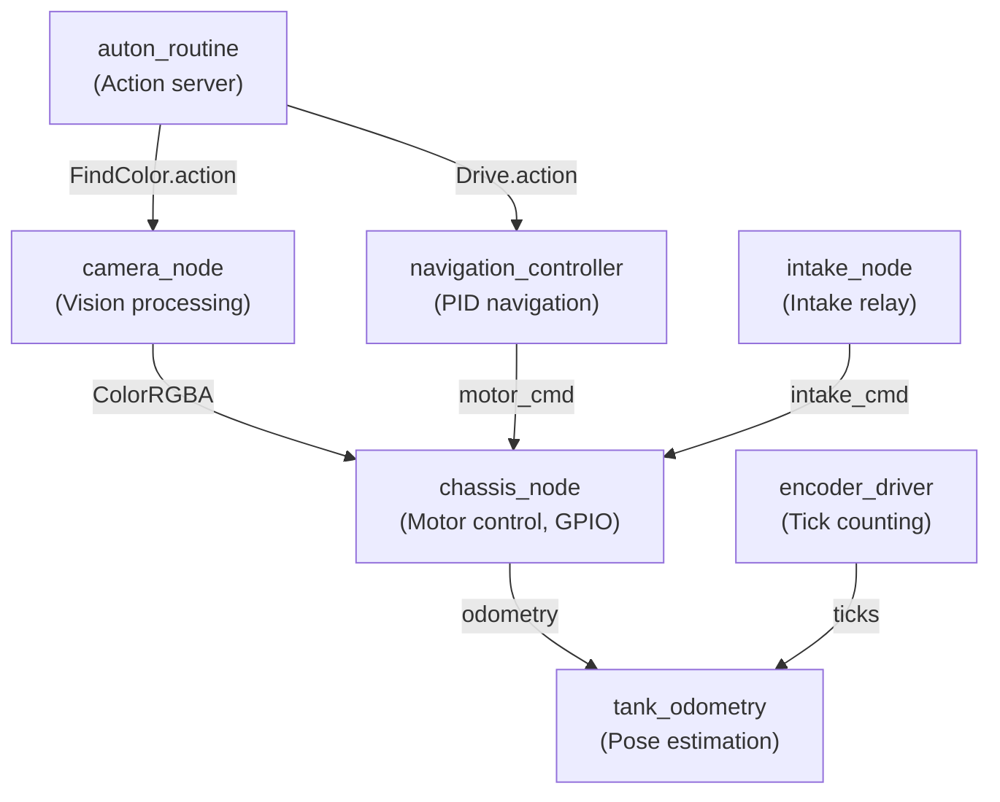
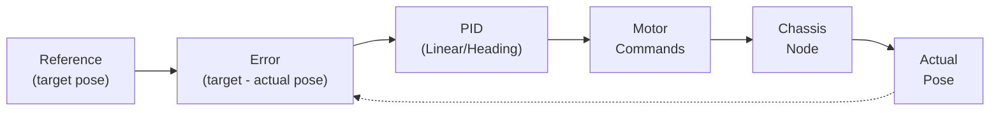
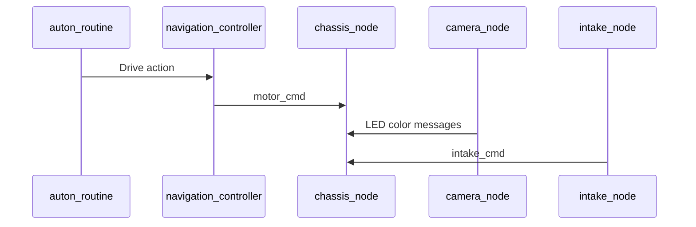

# IEEE Hardware Open Team Robot - ROS2 Control Stack
*A modular, multithreaded control stack built with ROS 2 Jazzy for IEEE SoutheastCon 2026.*

---

## Project Overview
This repository contains the **competition-ready control stack** for the IEEE Hardware Open Team Robot that competed at **IEEE SoutheastCon 2026**, placing **3rd in the Open Team Division**, achieving **80% accuracy in expected score**. The robot is powered by ROS 2 and features:
* Executes precise **tank drive kinematics** with encoder feedback and IMU fusion
* Performs **camera-based color detection** and start light sensing for autonomous operations
* Runs **PID-tuned navigation** with coordinate-based path planning
* Utilizes **multithreaded ROS 2 nodes** for chassis control, vision processing, and sensor integration
* Features **hardware-accelerated drivers** using pigpio for PWM and interrupts
* Implements **ROS 2 Actions** for standardized drive and detection commands

The codebase is modular with separated hardware drivers and ROS nodes, ready for testing and expansion.

---

## Key Features
| Category | Highlight |
| -------- | --------- |
| **Tank Drive** | 4-wheel drive with encoder feedback, precise forward/backward and turning |
| **Odometry** | Threaded fusion of encoders and IMU at 100Hz for accurate pose estimation |
| **Vision Processing** | OpenCV-powered color detection and LED feedback via camera |
| **Navigation** | PID-controlled coordinate-based movement with real-time adjustments |
| **Sensor Integration** | Hardware drivers for MPU6050 IMU and PCA9685 I2C to PWM Driver Module |
| **Autonomous Routines** | Action servers for drive commands and color finding with feedback |
| **Multithreading** | ROS 2 nodes running concurrently for chassis, camera, intake, and odometry |
| **Hardware Acceleration** | lgpio library for precise PWM control and sensor interrupts |

---

---

## High-Level Architecture

---

## PID Control
> *PID parameters are configured in the navigation_controller node.*

The robot uses **PID loops** for linear motion and heading control in navigation.

### Control-Loop Model

### Continuous-Time Law

$$
u(t) = K_p\,e(t) + K_i\!\!\int_{0}^{t}\! e(\tau)\,d\tau + K_d\,\frac{de(t)}{dt}
$$

### Discrete Implementation

$$
u[k] = K_p\,e[k] + K_i\,\sum_{i=0}^{k} e[i]\,\Delta t + K_d\,\frac{e[k]-e[k-1]}{\Delta t}
$$

| Loop          |    $K_p$ | $K_i$ | $K_d$ | Notes                    |
| ------------- | -------: | ----: | ----: | ------------------------ |
| Linear Motion |     17.4  |   0.0 |   170.0 | Configurable in code     |
| Heading Hold  |     8.0  |   0.0 |   20.0 | IMU-based correction     |

---

## 🧵 Multithreading Model

| Node                | Priority | Function          |
| ------------------- | -------: | ----------------- |
| chassis_node        |       High | Motor PWM, GPIO interrupts |
| camera_node         |       Medium | Vision processing, LED control |
| navigation_controller|       Medium | PID control, path planning |
| intake_node         |       Low | Command relay with watchdog |
| tank_odometry       |       High | 100Hz pose fusion |
| encoder_driver      |       High | Atomic tick counting |

---
